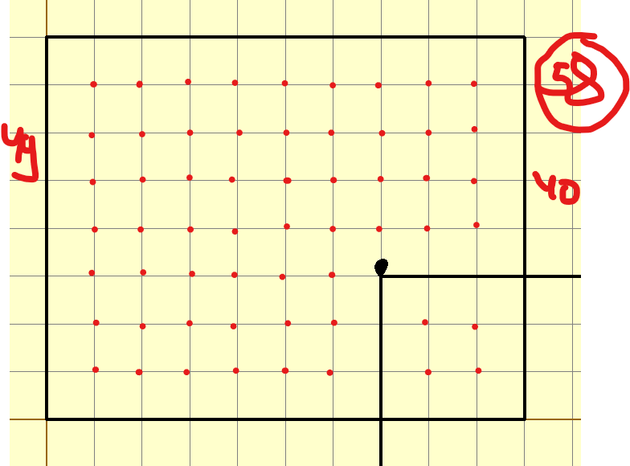

```кумир
использовать Черепаха
алг
нач
опустить хвост
нц 2 раз
назад(-8)
вправо(90)
вперед(10)
вправо(90)
кц

поднять хвост
вперед(3)
вправо(90)
вперед(7)
влево(90)
опустить хвост

нц 2 раз
вперед(-12)
вправо(90)
назад(-13)
вправо(90)
кц

кон

```

