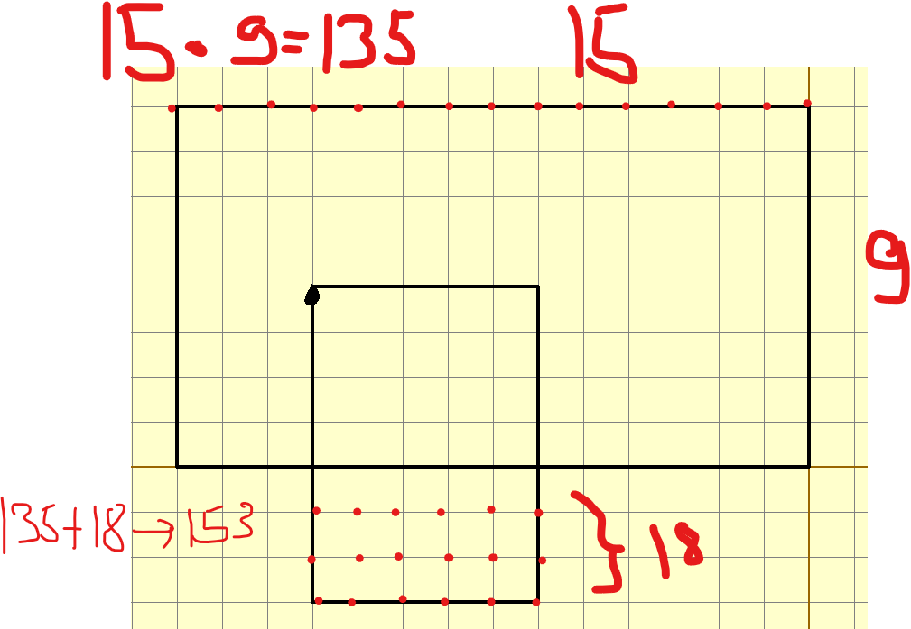

```кумир
использовать Черепаха
алг
нач
опустить хвост
нц 3 раз
вперед(8)
влево(90)
вперед(14)
влево(90)
кц
поднять хвост
вперед(4)
вправо(90)
назад(3)
влево(90)

опустить хвост
нц 2 раз
вперед(7)
влево(90)
вперед(5)
влево(90)
кц

кон

```
